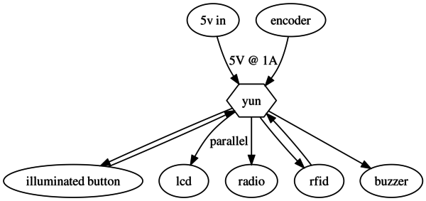

# Hackspace machine access & usage logger

A system for allowing inducted users to turn power on to various machines. 

* Users are authenticated with RFID.
* Usage time is logged to a google spreadsheet.
* Inducted users are managed using a google spreadsheet.

Shortlink: [http://ven.nz/hkspcpc](http://ven.nz/hkspcpc)

# Project log

[Project log details design, build and testing](project_log.md)

# Software

Split into:

* [Arduino code](software/power_controller/) for UI, RFID and radio. 
* [Python code](software/python/) for local caching, internet logging.

## Design decisions

* Presenting an inducted user's RFID card will authenticate.
* Simple menu system to scroll through available tools and start/stop them.
* Never switch off/time out the connected machine in case it's a long job.
* Pull validated users once per day and store locally in case internet is unavailable.
* If internet is unavailable discard usage logging. Possible to add a queue later.

## Flowchart

## User Interface

See the [UI](ui.md) doc.

# Electrical

## Bill of Materials

See the [bom](bom.md)

## Wiring

## Schematic

For interconnects, power and buzzer.

## Case design

[Case design](case/case.md) [generated with openscad file case.scad](case/case.scad)

# Shortcomings

In many cases easy to bypass, but as used in a trusting environment, not seen as a big issue. 

To protect the plugs a locking box could be made out of wood that would contain an extension lead end, the radio power switch and the end of the machine cable.

To protect the spreadsheet, it could be split into different sheets and then
shared separately.

# Licenses

* Hardware is licensed under the [CERN open hardware license 1.2](http://www.ohwr.org/attachments/2388/cern_ohl_v_1_2.txt)

* Software is licensed under a Creative Commons Attribution 4.0 International License.
